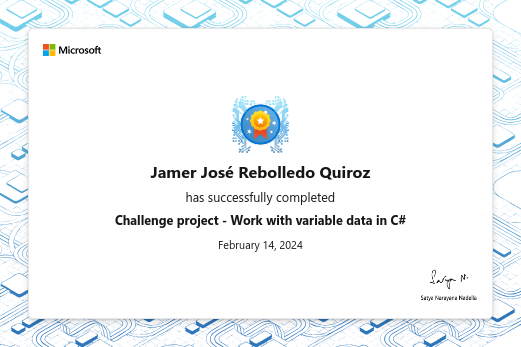

# Challenge Project - Work with Variable Data in C#

## Introduction

Suppose you're one of the developers working on the Contoso Pets adoption
application to help find new homes for pets. Your starting version of the
application gathers a single search term used to search the descriptions of
dogs. A single term search is helpful, but the feedback given from the team is
the application needs more search functionality. The team wants you to extend
the search functionality to allow for multiple term searches. Additionally, the
team wants to pilot an update to the "search status" animation that shows search
progress.

In this challenge coding project, your C# data knowledge and skills are applied
for:

Creating string arrays by splitting strings Manipulating array data, iterating
through elements in an array, and sorting array data Modifying and building
strings from multiple data sources In short, you'll:

Develop multi-term search functionality for the "dogs" search Update the "search
status" animation, information and countdown By the end of this module, you
complete an updated version of the Contoso Pets application that searches all
dogs available for adoption using multiple search terms and an improved search
status simulation.

## Prepare for challenge

### Project specification overview

Update the existing Contoso Pets starter application to include multiple term
search and improved "search status" animation features:

#### Add dog attribute multi-term search Gather user input for the pet characteristic multiple term search

- Users need to provide search terms separated by commas
- Store the search terms in an array and sort the terms alphabetically

Within the animals array loop that identifies "dogs":

- Iterate through the search terms to search each dog's description
- Search the combined description for a term match
- Output each dog's description where there's one or more terms matched

After exiting the "search Animals" array loop that identifies dogs:

- If no dogs were a match for any of the users provided search terms, output a
  no dogs matched message.

#### Add "search status" improvements

Update the animation

- Adjust the `searchingIcons` array to resemble a spinning dial
- Adjust the animation loop so the animation shows a numeric countdown from two
  to zero (2.., 1.., 0..)

## Add multi-term search functionality

The Contoso Pets application currently searches for dogs based on a single term.
The team wants to extend the search functionality to allow for multiple term
searches. The team also wants to pilot an update to the "search status"
animation that shows search progress.

### Search specifications

#### Gather multiple search terms from the user

- Allow the user to enter multiple search terms when searching for dogs
- The user needs instructions to "enter the search terms separated by commas"
- Separate out individual search terms from the user entry string and store as
  values in an array
- Sort the terms in the array in alphanumeric sort order

#### Identify dogs with descriptions with matches for one, or more, user search term

- As you identify a dog in the `animalsArray`, search for matches for each term
  the user has entered
- For a term match, output a message with the dogs name and the term that is
  matched
  - example: `Our dog Jake is a match for your search for sheppard!`
- When all term searches complete for the current dog description:
  - For one or more matches, output the nickname and description for the current
    dog
  - For one or more matches, track that there has been a match so you know not
    to display an "no matches found for any available dogs" message (refer to
    the next item)
- After all dog searches complete with no matches, display a message "No matches
  found for any available dogs"

#### Enforce the following validation rules

- values can't be null
- values can't have zero characters
- any further restriction is up to the developer

#### Code comments

- Numbered code comments in the starter code offer suggestions
- The comments are in a sequential order and only the comments starting with #1,
  #2, and #3 apply to this exercise of the challenge

#### Sample output

Review the following animated image

- Notice the temporary display of "`searching...`" followed by the current term (example: "`searching...retriever`")

- Notice the order the terms appear in search is now in alphanumeric

- Notice the messages for matches persist (example: "`Our dog lola is a chase match!`")

## Code

[C#](./Challenge-Project-variable-data-in-CSharp-main/Starter/Program.cs)

## Summary

Your challenge was to update an application to support multiple term search and to improve the "search status" information animation.

In this module, you developed code that combines:

- Iteration statements using data input
- Data processing
- Formatting data output
- Choosing the correct data types and safely converting data types
- Creating and manipulating string arrays, and sorting array data
- Modifying and building complex strings from multiple data sources, and formatting data for display

You delivered functionality to your Contoso pet app team, including:

- Gather the pet characteristics for multiple search term inputs
- Store search input terms in a sorted array
- Display the dogs that have a term match
- Provide an improved search status animation with a countdown

## Achievement

